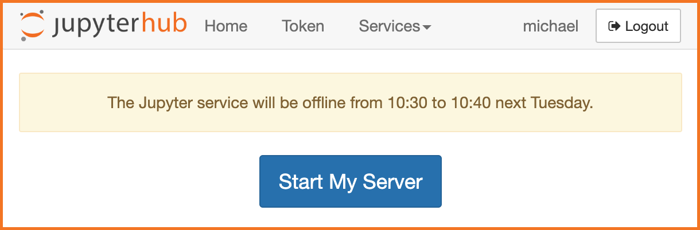

# jupyterhub-announcement

This is an announcement service for JupyterHub that you can manage through a JupyterHub-styled UI.
You can use it to communicate with your hub's users about status, upcoming outages, or share news.
It allows you to post a current announcement, and show previous announcements in reverse chronological order.
It provides a REST API hook that you can use to post the latest announcement on JupyterHub itself (with custom templates).
Announcements are visible even to users who are logged out.

## Requirements

* [jupyterhub](https://pypi.org/project/jupyterhub/)
* [html-sanitizer](https://pypi.org/project/html-sanitizer/)
* [aiofiles](https://pypi.org/project/aiofiles/)

## Installation

    pip install git+https://github.com/rcthomas/jupyterhub-announcement.git

## How to Configure It

You can run this service either as a hub-managed service or as an external service.
Here's an example configuration for a hub-managed service you can place in a JupyterHub config file:

    c.JupyterHub.services = [
        {
            'name': 'announcement',
            'url': 'http://127.0.0.1:8888',
            'command': ["python", "-m", "jupyterhub_announcement"]
        }
    ]

Here's the config if you set it up as an external service, say, in another Docker container called `announcement`:

    import os
    c.JupyterHub.services = [
        {
            'name': 'announcement',
            'url': 'http://announcement:8888',
            'api_token': os.environ["ANNOUNCEMENT_JUPYTERHUB_API_TOKEN"]
        }
    ]

You have to specify the API token for the hub and the announcement service to share here.
Starting with JupyterHub 2.0, you will need to set user access through appropriate definition of `c.JupyterHub.load_roles`.

The service also has its own configuration file, by default `announcement_config.py` is what it is called.
The configuration text can be generated with a `--generate-config` option.

If you're running a hub with internal SSL turned on, you'll want to take advantage of the SSL option settings.

## How to Use It

What does it actually look like when it runs?
Start up the hub.
Log in as an admin user, then go to

    http://localhost:8000/services/announcement/

You should see:

You'll now see the same page as before but with a text box.
Enter a message. Please note that your input will be sanitized.
For security reasons, a few HTML tags such as "<iframe>" or "
    

**BE CAREFUL** It should be pretty clear at this point that you want to ensure your admins can be trusted!

## Fixed Message

There's a hook in the configuration that lets you add a custom message above all the annoucements.
A good use for this message would be to include a link to a more general system status or message of the day (MOTD) page.

## Announcement Lifetime

Announcements are retained in the queue for up to some configurable lifetime in days.
After that they are purged automatically.
By default announcements stay in the queue for a week.

## Persisted Announcements

By default the service does nothing to persist announcements.
You can change this behavior by specifying `persist_path` for the `AnnouncementQueue` object.
If this is set, then at start up the service will read this file and try to initialize the queue with its contents.
If it is set but the file doesn't exist, that's OK, the queue just starts off empty.
On update, the file is over-written to reflect the current state of the queue.
This way if the service is restarted, those old announcements aren't lost.
The persistence file is just JSON.
**BE CERTAIN** access to this file is protected! 
