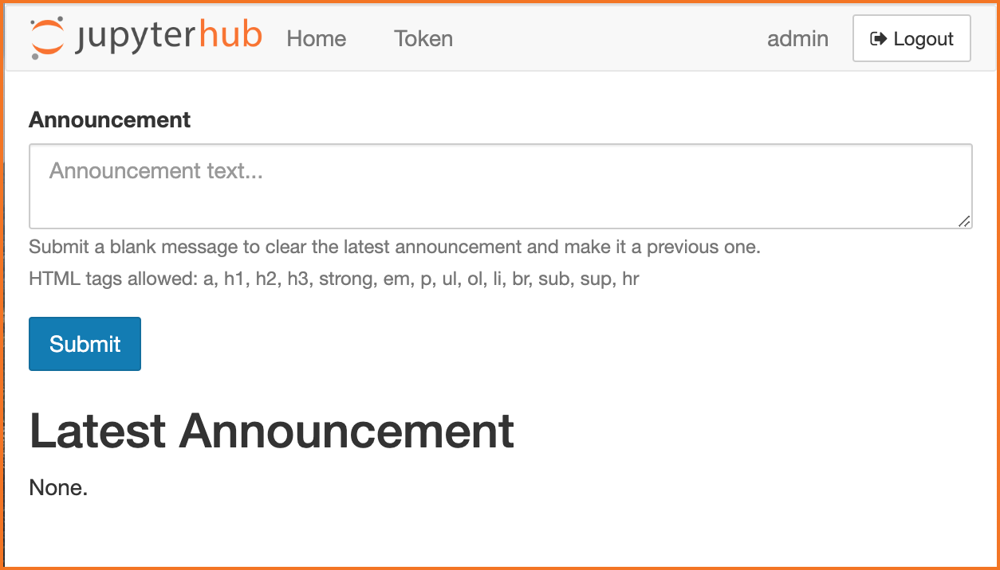
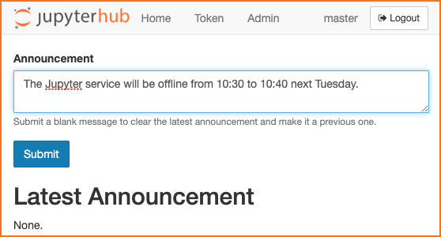
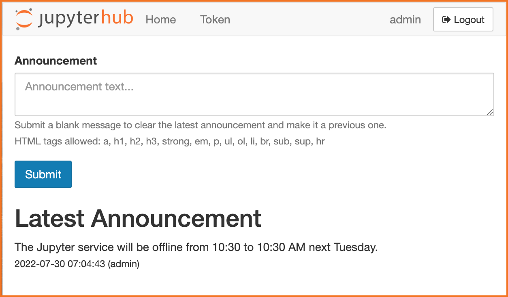
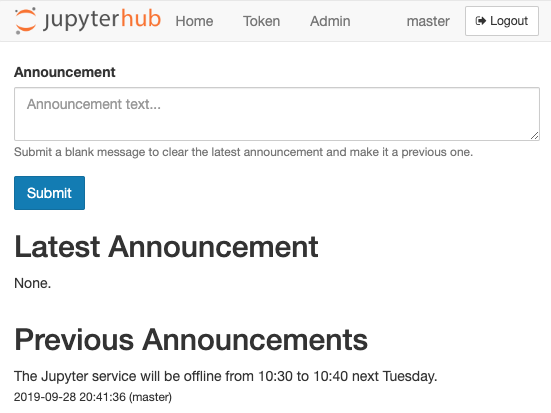
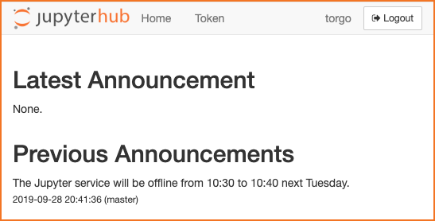

# jupyterhub-announcement

This is an announcement service for JupyterHub that you can manage through a JupyterHub-styled UI.
You can use it to communicate with your hub's users about status, upcoming outages, or share news.
It allows you to post a current announcement, and show previous announcements in reverse chronological order.
It provides a REST API hook that you can use to post the latest announcement on JupyterHub itself (with custom templates).
Announcements are visible even to users who are logged out.

## Requirements

This service re-uses JupyterHub's static assets and templates to achieve a consistent UI between the hub and the service UI.
As such, it requires that you have JupyterHub installed.
You probably do.

## Installation

    pip install git+https://github.com/rcthomas/jupyterhub-announcement.git

## How to Configure It

You can run this service either as a hub-managed service or as an external service.
Here's an example configuration for a hub-managed service you can place in a JupyterHub config file:

    c.JupyterHub.services = [
        {
            'name': 'announcement',
            'url': 'http://127.0.0.1:8888',
            'command': ["python", "-m", "jupyterhub_announcement"]
        }
    ]

Here's the config if you set it up as an external service, say, in another Docker container called `announcement`:

    import os
    c.JupyterHub.services = [
        {
            'name': 'announcement',
            'url': 'http://announcement:8888',
            'api_token': os.environ["ANNOUNCEMENT_JUPYTERHUB_API_TOKEN"]
        }
    ]

You have to specify the API token for the hub and the announcement service to share here.

The service also has its own configuration file, by default `announcement_config.py` is what it is called.
The configuration text can be generated with a `--generate-config` option.

## How to Use It

What does it actually look like when it runs?
Start up the hub.
If you're running this locally on port 8000 (or in a Docker container with that port exposed), go to

    http://localhost:8000/services/announcement/

If all goes well you'll see a mostly blank JupyterHub-style page with "None" for the "Latest Announcement."

Now go ahead and click the convenient login button.
Log in as an admin user, then go back to the above URL.

You'll now see the same page as before but with a text box.
Enter a message.

That becomes the Latest Announcement.

If you enter an empty message, it clears that message and demotes it to a Previous Announcement.

Go on.  Add a few more.  Then log out.
Now log in using a test user who is not an admin.
Point back at the announcement page and there you see all these wonderful communications your friendly admin sent to you.

Log out again and have a look.
You can see them even if you're logged out.

## REST Endpoint

Use the `/services/announcement/latest` endpoint to get the latest announcement in JSON form.
You can make a call out to the service to get the announcement from the hub, if you customize the page template.
Users may like that.
If the latest announcement has been cleared or there are no announcements yet, an empty announcement will be returned.

## Fixed Message

There's a hook in the configuration that lets you add a custom message above all the annoucements.
A good use for this message would be to include a link to a more general system status or message of the day (MOTD) page.

## Persisted Announcements

By default the service does nothing to persist announcements.
You can change this behavior by specifying `persist_path` for the `AnnouncementQueue` object.
If this is set, then at start up the service will read this file and try to initialize the queue with its contents.
If it is set but the file doesn't exist, that's OK, the queue just starts off empty.
On update, the file is over-written to reflect the current state of the queue.
This way if the service is restarted, those old announcements aren't lost.
The persistence file is just JSON.
**BE CERTAIN** access to this file is protected! 

## Things That Could Use Work

We should put a cap on the size of the announcement queue, or expire them after some time period.

The README could have more pictures.
