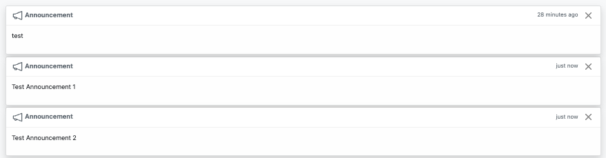

If you want to use a react component in your project, you can use the `react-component` example.
This example shows a component which fetches announcements and loads them as toasts. See image below:

